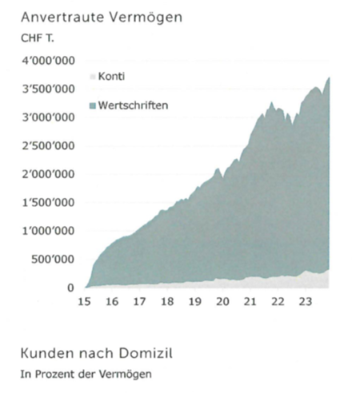

+++
title = "Die Rückkehr der traditionellen Privatbank"
date = "2024-04-26"
draft = false
pinned = false
image = "bank.jpg"
description = "Privatbanking"
footnotes = "Abb 1. Bild von Flurin Vogt\n\nAbb 2. Grafik von Zähringer Privatbank"
+++

Der Bankenmarkt ist seit Jahren in Aufruhr: der Fall von Lehman Brothers im Jahr 2008 und im letzten Jahr der Fall der Schweizer Credit Suisse. Wieso gründet man in dieser Lage eine Privatbank in der Bundeshauptstadt der Schweiz? Und wie genau schafft es diese Privatbank, sich ohne grössere Probleme durch den Sturm zu bewegen?


*von Cederic und Flurin*

Wenn man den Schmiedenplatz in Bern hinter dem Kornhaus betritt, muss man zweimal hinschauen, um die Zähringer Privatbank zu erkennen. Dies ist ein starker Kontrast zu den bekannten Banken an der Bahnhofstrasse oder dem Paradeplatz in Zürich. Sie befindet sich in einem altehrwürdigen Gebäude, direkt neben dem Restaurant Schmiedstube, nur ein diskreter Schriftzug und eine Plakette weisen darauf hin. Wenn man die Bank betritt, ist man umgeben von einer strahlenden, stillen, zeitlosen Eleganz. Der Konferenzraum ist holzgetäfelt und in der Ecke befindet sich ein alter Kachelofen; die Wände wurden im Hellblau der Bank gestrichen. Nach kurzer Zeit begrüsst uns Herr Schenk zusammen mit einer seiner Mitarbeiterinnen. Beide sind sehr ruhig, gelassen und äusserst freundlich. 

## Herr Martin Schenk

Herr Schenk arbeitete, bevor er die Zähringer Bank mitgründete, bei der Wegelin Bank, der ältesten Privatbank der Schweiz, bis sie im Jahre 2012 unterging, weil sie sich mit USA-Kundengeschäften die Finger verbrannt hatte. Sie nahm den Namen Notenstein AG an, die unter der Raiffeisen Bank tätig war, bevor sie an die Vontobel Bank verkauft wurde. Bei der Bank Wegelin sei alles bis zur Pensionierung durchorganisiert gewesen, und bei der Notenstein hätten sie nur noch als Manager gearbeitet, erklärt Herr Schenk. Umso mehr habe es ihn getroffen, dass die Bank fiel. Diese Enttäuschungen führten unter anderem zur Gründung der Zähringer Bank, bei der noch heute noch ein Kernteam von Wegelin tätig ist. Herr Schenk ist sehr offen und hält sich mit seiner Meinung nicht zurück

> Auf den grünen Wiesen etwas zu machen, das den neuen Verhältnissen entsprechend ist.

## Die Gründung der Zähringer Privatbank

Die Gründung der Zähringer Bank 2015 erfolgte laut Herrn Schenk ohne Altlasten, man konnte sich auf die neue Bankenwelt ausrichten, oder wie er formuliert: «Auf den grünen Wiesen etwas zu machen, das den neuen Verhältnissen entsprechend ist». Zum Gründen der Zähringer brauchten sie ein Kapital von 20 Millionen Franken. Im Gesetz stehe zwar die Hälfte, doch die FINMA würde den Betrag verdoppeln. Das Kundenkapital befand sich am Anfang auf null, doch bereits im nächsten Jahr ermöglichte eine schlanke Kostenstruktur den Jahresabschluss in der Gewinnzone. Die Bank selbst entwickelte sich weiter und verwaltet heute ein Vermögen von über 3.7 Milliarden Franken, was in Zeiten der Krisen äusserst beeindruckend ist. Das letzte Jahr war wegen der CS-Krise für die Zähringer gut, so gewann sie laut Herrn Schenk in diesem Jahr am meisten Neukunden. Dies erreichte sie auch damit, dass sie sich auf traditionelles Handwerk fokussiert. Generell seien Bankgründungen heute eher untypisch, erklärt Ralph Stadler; dies läge vor allem an den hohen Kosten und dem Aufwand, der damit verbunden sei. Ralph Stadler ist ein Jurist, der nicht bei der Zähringer Bank arbeitet.



## Dr. Jus. Ralph Stadler

Der 1960 in Montreal geborene Jurist Ralph Stadler kennt sich sehr gut im Bankenwesen und mit Rechtsfragen aus. Er hat zusammen mit anderen Juristen das Standardwerk zum Schweizer Bankensystem («Das Schweizer Bankengeschäft») verfasst. Heute arbeitet er bei der Investmentfirma Patinex, welche sich auf demselben Gelände wie die BZ Bank, bei der er früher gearbeitet hat, befindet. 


> «Wir nennen den Begriff ‘eigentümergeführt’»

## Zähringer System versus andere Privat- und Grossbanken

Herr Schenk erklärt, dass die Zähringer Bank ein Privatbanking im klassischen Sinn verrichte. Heute sei der Begriff ‘Privatbanking’ neu besetzt. Früher gehörten die Privatbanken Familien, die für Verluste hafteten. Dies führte vermutlich dazu, dass das Vertrauen der Kunden grösser war, die Bank gleichzeitig auch weniger Risiken einging, denn wenn die Bank unterging, bedeutete dies auch den Untergang des Bankiers. Die Beteiligung der Mitarbeiter, wie dies bei der Zähringer der Fall ist, wird von Martin Schenk folgendermassen beschrieben: «Wir nennen den Begriff ‘eigentümergeführt’. Für uns ist eine Bank eigentümergeführt, wenn mehr als zwei Drittel der Aktien den Mitarbeitern gehören». Ralph Stadler sagt zum Thema Gewinnbeteiligung: «Eine richtig verstandene Gewinnbeteiligung bedeutet Gewinn- und Verlustbeteiligung». 
Anders als die grossen Privatbanken in Genf und Zürich wie Pictet, Edmond de Rothschild, Sarasin und andere betreibt die Zähringer keine internationalen Kundengeschäfte. Den Anteil von nur 0,8 % internationaler Kunden erklärt Herr Schenk damit, dass sich die Zähringer auf den Standort Schweiz konzentrieren wolle. Dies unterstreicht er mit einer Grafik, die zeigt, dass der einzige Sektor, bei dem die Kostenschere im Vergleich zu früher kaum auseinander geht, im Privatbanking ohne internationale Kunden liegt. Der Fokus auf Schweizer Kunden lässt auch die Standortwahl der Zähringer in einem neuen Licht erscheinen. Herr Schenk erklärt, dass Genf und Zürich zwar bessere Standorte für internationale Banken seien, die Zähringer aber insbesondere mit Kunden aus der Schweiz arbeite, sodass der Standort Bern kein Nachteil sei.
Ein weiterer Grund, warum sich in Bern weniger internationale Privatbaken niederlassen, dürften die Berner Steuern sein, welche im Vergleich zu anderen Kantonen sehr hoch sind. Bezüglich Steuern sagt Martin Schenk, dass die Zähringer einen Berner Namen habe, die Mitarbeiter in Bern leben würden und es so auch nur richtig sei, dass sie in Bern die Steuern zahlen würden. 
Laut Herrn Stadler bedeuten die für Banken zunehmend ansteigenden Kosten ein zusätzliches Problem. Dass dies vor allem für kleine Banken schwierig sein könnte, wird auch von einer weiteren Person betont. Diese Person arbeitet ebenfalls in einer Bank, in der Abteilung der Vermögensverwaltung, sie möchte anonym bleiben. Trotz dieser Anonymität sind ihre Informationen sehr fundiert und geben eine gute Alternative zu den Ansichten von Herrn Schenk und Herrn Stadler.
Mit dem Wegfall des internationalen Kundengeschäftes konzentriert sich die Zähringer auf Vermögensverwaltung, -erhaltung und im besten Falle -wachstum; ein zusätzlicher Sektor ist die berufliche Vorsorge (BVG). Auf die Frage, ob die Bank lieber Privat- oder Vorsorgevermögen verwalte, erklärt Herr Schenk schmunzelnd, dass zwischen den beiden Typen nur ein Altersunterschied bestehe. Zuerst würde jemand in das Vorsorgevermögen einzahlen, sobald er pensioniert sei, rutsche er ins Privatvermögen. 
Privatbanken haben den Ruf, dass sie nur vermögenden Menschen zugänglich sind. Die Zähringer Bank macht aber gemäss Herrn Schenk keine Kundenselektion, da auch junge Menschen mit noch geringem Vermögen in ihrer weiteren Laufbahn erfolgreich sein und zu Geld kommen könnten. 

## Vorteile von Privatbanken

Privatbanken bieten laut Herrn Schenk Vorteile, die mit einer 2023 veröffentlichten Studie von PricewaterhouseCoopers (PwC), einer Beratungs- und Prüfungsfirma, untermauert werden. Diese Studie besagt, dass erfolgreiche Privatbanken ein Kerngeschäft haben sollten, das traditionelle Investments und standardisierte Preiskonditionen beinhaltet. Auch betont sie die Wichtigkeit von privaten (nicht institutionellen) Kunden mit Schweizer Domizil und einem investierbaren Kapital von 1 bis 5 Millionen Franken. Bezüglich der Mitarbeiter empfiehlt die Studie mindestens 40 % Vollzeitstellen (FTE). Alle operativen Kosten sollten flexibel sein und alle Tätigkeiten ausser den Kerngeschäften ausgelagert werden. Die Studie kommt zum Schluss, dass auch kleine Privatbanken grössere Privatbanken übertrumpfen können, wenn sie sich an die obigen Aspekte halten.
Bezüglich der Mitarbeiter hat die Zähringer Bank 60 % Vollzeitstellen (FTE). Die Zähringer erfüllt 4 der obigen 5 Aspekte (keine High Net-Worth-Personen mit einem Vermögen von 1 bis 5 Millionen CHF), sodass man zum Schluss kommen kann, dass die Zähringer Privatbank in die Kategorie der 5 top Performer fällt. 
Martin Schenk ergänzt aber, dass es alle Bankentypen, also private, kantonale, Robo- und Grossbanken brauche. Auch wenn er mit der Monster-UBS nicht glücklich sei, habe man damit eine Finanzkrise verhindern können. Laut der anonymisierten Person könnten die hohen Kosten für die Digitalisierung und Regulierung, die für alle Banken gleich sind, für kleinere Banken ein Problem werden. 
Unter Mitberücksichtigung aller Punkte darf man trotz der vielen Vorteile von Privatbanken die Wichtigkeit von Universal- oder Grossbanken nicht unterschätzen, zumal Letztere teilweise auch einen weltweiten Service anbieten mit Filialen auf der ganzen Welt. 
 
## Schweizer Bankenmarkt heute

Der Schweizer Bankenmarkt befindet sich in einem Sturm, dieser wurde vor einem Jahr mit dem Fall der Credit Suisse wieder entflammt. Die Meinungen, ob die Übernahme der CS durch die UBS eine gute Lösung ist, gehen auseinander. Trotz der schwierigen Situation im Schweizer Bankenmarkt bleibt dieser für konservative Anleger nach wie vor attraktiv, erklärt Ralph Stadler, was auch von Herrn Schenk und der anonymen Quelle unterstützt wird. 
Doch wie lässt sich das Vertrauen in den einst stolzen Schweizer Bankenmarkt wieder herstellen? Insbesondere eigentümergeführte Privatbanken bieten einen grossen Vorteil, da sie ein gutes Kundenvertrauen aufbauen können. Trotzdem sind Privatbanken nicht für jedermann geeignet, sodass andere Bankenformen ebenfalls eine grosse Berechtigung haben. Herr Stadler betont, dass nicht spezialisierte Banken, wie dies bei vielen der Grossbanken der Fall ist, wichtig seien, dass aber auch spezialisierte Banken im Sinne von Privatbanken einen grossen Stellenwert hätten. 
Viele Kunden legen ihre Konten auf mehreren Banken an. Die anonyme Quelle allerding hält eine Beschränkung der Konten auf nur eine einzelne Bank für den Kunden für vorteilhafter, weil damit der Informationsfluss einfacher ist. Schlussendlich ist das Vertrauen in eine gut funktionierende Bank essentiell.  
Die Zähringer hat ein sehr spannendes und gutes Geschäftsmodell. Dennoch darf und kann man die Vorteile einer Universal- oder Grossbank nicht leugnen. Es stellt sich die Frage, ob auch Universal- oder Grossbanken ein gutes Kundenvertrauen aufbauen können. Da diese Banken vermutlich kaum eigentümergeführt sein können, müssen sie sich der Wichtigkeit des Kundenvertrauens bewusst sein, Verantwortung übernehmen und die Kunden wissen lassen, dass aus Fehlern gelernt wird und dass deren Geld sicher ist. Schlussendlich hat die Zähringer Bank mit ihrem System eine sehr sichere Basis für das Kundevertrauen; dies können andere Banken auch erreichen, auch wenn sie dafür ihren eigenen Weg gehen müssen.



### Begriffseklärung

**Robo-Banking:** Banking, das automatisch durch Algorithmen durchgeführt wird.

**Universalbanken:** Banken, die alle Dienstleistungen anbieten.

**Grossbanken:** Kreditinstitute, die ein besonders grosses Handelsvolumen haben und sehr bedeutend sind.

**FINMA:** Schweizer Finanzaufsichtsbehörde.

 
**Bankgeheimnis:** Geheimhaltung der Kundendaten.



